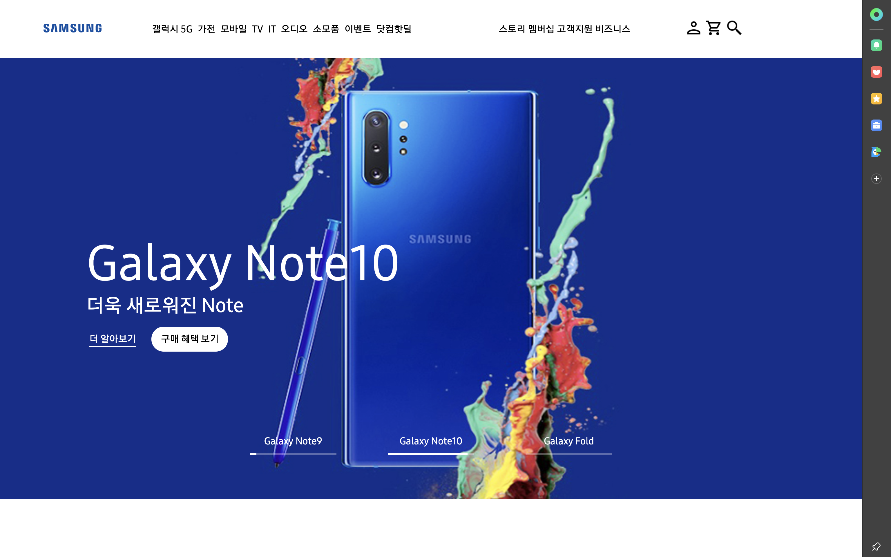
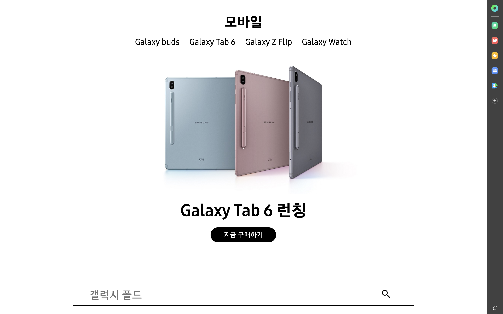

# samsumg-replica

삼성전자 홈페이지 클론 입니다

React 의 사용 방식과 CSS 에 대한 활용과 이해를 높이기 위해 진행했습니다

사용 기술

- create-react-app (CSR with no eject)

- Sass

React, sass(scss) 를 활용 디자인은 flexbox, grid system, 미디어 쿼리를 이용해 반응형 웹페이지를 고려했으며 Carousel 과 Navigation 을 구현한 웹 프로젝트 입니다.

- 스크린샷

